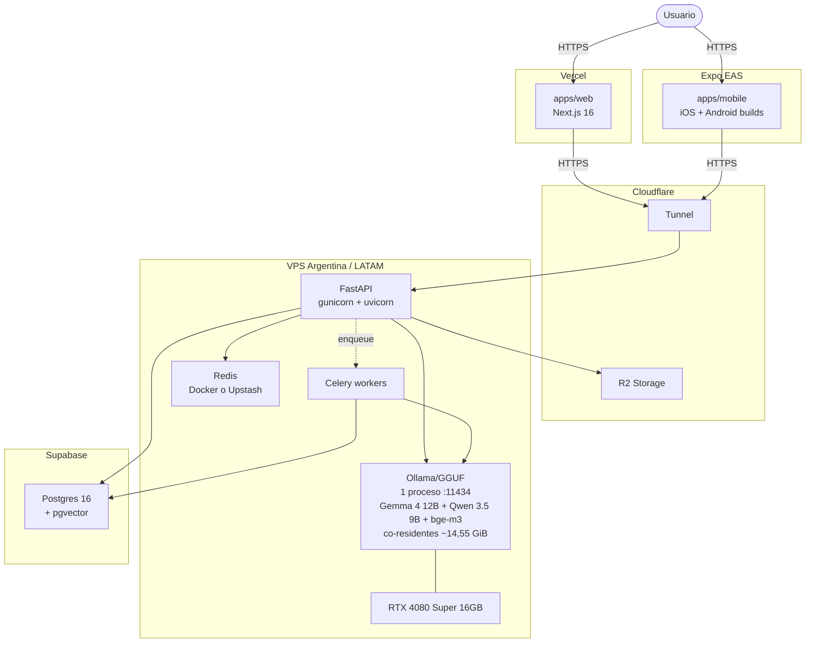

# Topología de deploy de Ynara

<!-- TODO: refinar con direcciones / puertos / firewalls específicos -->

## MVP (fase actual)

> **NOTA — Estado actual:** el motor de inferencia real todavía NO corre
> en ningún entorno. El backend usa Fakes (`FakeLlmClient`,
> `FakeEmbeddingClient`, `FakeReranker`) en su lugar. El nodo `OLLAMA` del
> diagrama representa el estado objetivo; su activación es un track de
> infra aparte, pendiente.
>
> **Motor de serving (ADR-014):** en la 4080 Super 16 GB el serving local
> es **Ollama/GGUF**, un solo proceso con Gemma 4 12B + Qwen 3.5 9B + bge-m3
> co-residentes (~14,55 GiB). `LLM_BACKEND=vllm` en `.env` es el **nombre
> legacy** del cliente OpenAI-compatible (apunta a Ollama hoy). vLLM
> multi-proceso (3 procesos :8001/:8002/:8003 + systemd por modelo en
> `infra/prod/`, levantados por `infra/vllm/start-vllm.sh`) es la ruta para
> GPU de 24 GB+, no la de la 4080.

## V2 (post-validación)

Mismo diagrama pero `SB` (Supabase) reemplazado por un Postgres
self-hosted en la misma VPS o en VPS dedicada. Detalle del cutover en
`docs/operations/MIGRATION-SUPABASE-TO-SELFHOSTED.md`.

## Notas

- La 4080 Super tiene 16 GB de VRAM. Gemma 4 12B (dense) cuantizado
  + Qwen 3.5 9B cuantizado + bge-m3 co-residen dentro de los 16 GB
  (confirmado por medición — ADR-012). En 16 GB el motor es **Ollama/GGUF**:
  un solo proceso (:11434) sirve los tres modelos co-residentes (~14,55 GiB,
  ADR-014). `LLM_BACKEND=vllm` es el **nombre legacy** del cliente
  OpenAI-compatible, no implica que corra vLLM. El Gemma 4 26B-A4B original
  no entraba; el cambio a 12B cerró esa restricción de VRAM.
- **vLLM = ruta 24 GB+** (ADR-014 D2): 3 procesos en puertos distintos
  (:8001 gemma, :8002 qwen, :8003 bge), una entrada por modelo en
  `LLM_SERVING` (ADR-013), levantados por `infra/vllm/start-vllm.sh` con
  systemd units por modelo en `infra/prod/`. No es la ruta de la 4080.
- Cloudflare Tunnel evita abrir puertos en la VPS y oculta IP real.
- R2 para storage de exports de usuario, backups cifrados, assets
  estáticos pesados.
