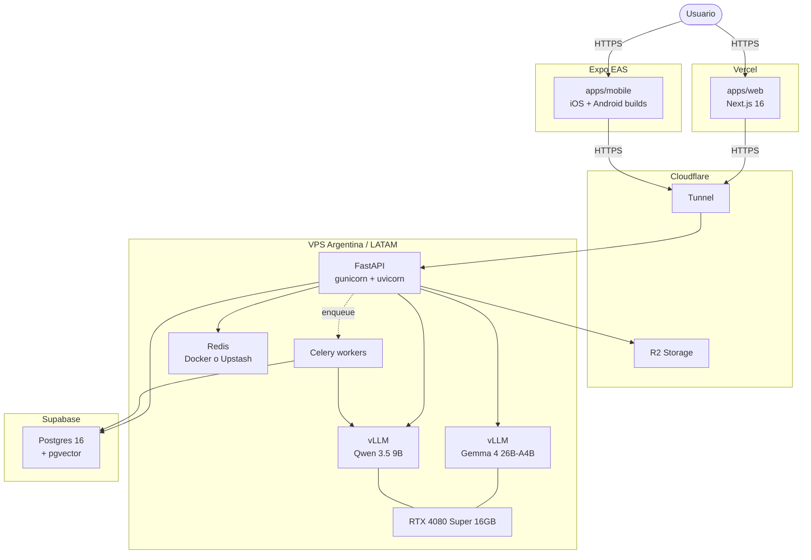

# Topología de deploy de Ynara

<!-- TODO: refinar con direcciones / puertos / firewalls específicos -->

## MVP (fase actual)

> **NOTA — Estado actual:** el vLLM real todavía NO corre en ningún
> entorno. El backend usa Fakes (`FakeLlmClient`, `FakeEmbeddingClient`,
> `FakeReranker`) en su lugar. Los nodos `VLLM_G` y `VLLM_Q` del
> diagrama representan el estado objetivo; su activación es un track de
> infra aparte, pendiente.

## V2 (post-validación)

Mismo diagrama pero `SB` (Supabase) reemplazado por un Postgres
self-hosted en la misma VPS o en VPS dedicada. Detalle del cutover en
`docs/operations/MIGRATION-SUPABASE-TO-SELFHOSTED.md`.

## Notas

- La 4080 Super tiene 16 GB de VRAM. Cargar Gemma 4 26B-A4B
  cuantizado + Qwen 3.5 9B cuantizado simultáneamente es tight pero
  posible; alternativa es alternancia con cache LRU.
- Cloudflare Tunnel evita abrir puertos en la VPS y oculta IP real.
- R2 para storage de exports de usuario, backups cifrados, assets
  estáticos pesados.
