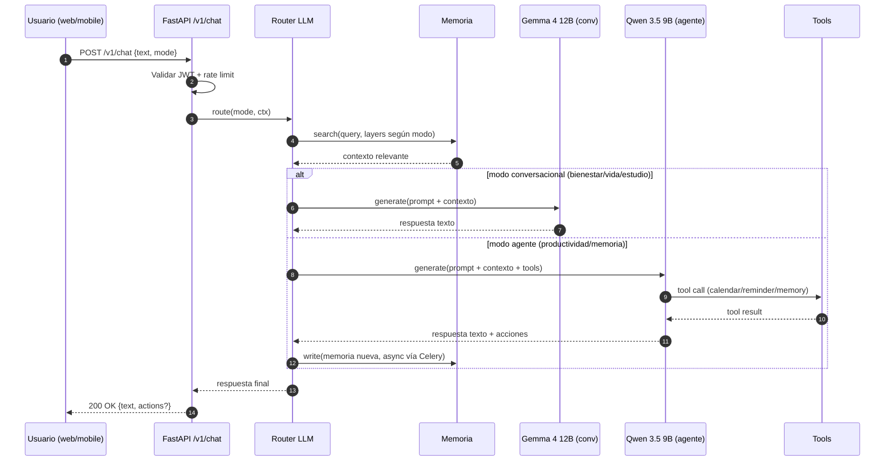

# Flujo de un mensaje en Ynara

<!-- TODO: refinar con detalle de auth, rate limits, telemetría -->

## Notas

- La extracción y consolidación de memoria episódica/procedural va
  **siempre asíncrona** vía Celery (regla extendida en
  `docs/conventions/AI-GUIDELINES.md`).
- Gemma nunca escribe memoria. Solo Qwen tiene esa capacidad.
- El router decide modelo según `ynara.config.json[modes][...].model`.
- **Rate-limit YA está activo** (`app/core/ratelimit.py`): chat por
  `user_id`, login/register/refresh por IP, export/wipe/sessions por
  `user_id`. El paso `Validar JWT + rate limit` del diagrama es estado
  actual, no objetivo.
- **Gemma/Qwen se sirven vía Ollama** en 16 GB (un endpoint :11434,
  ADR-014); `LLM_BACKEND=vllm` es el nombre legacy del cliente
  OpenAI-compatible. Hoy el cliente LLM es un Fake (`FakeLlmClient`)
  hasta que el track de infra de serving esté disponible.
