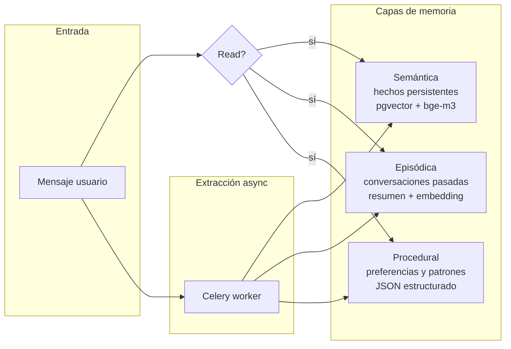

# Modelo de memoria de Ynara — 3 capas

<!-- TODO: completar con ejemplos concretos de qué entra en cada capa -->

## Capas

### Semántica
Hechos persistentes sobre el usuario y su mundo.
- "Mateo trabaja en X", "Mateo estudia Y en la UBA".
- Engine: Mem0 OSS v2.
- Store: `semantic_memory` (Postgres + pgvector).
- Embedding: bge-m3.

### Episódica
Resúmenes de conversaciones pasadas, recuperables por contexto.
- "Hace dos semanas Mateo estaba preparando un parcial de cálculo".
- Store: `episodic_memory` (Postgres + pgvector + JSONB).
- Resumen generado por Qwen al cerrar la conversación.

### Procedural
Preferencias y patrones de comportamiento.
- "Prefiere recordatorios a la noche", "saluda con 'che'".
- Store: `procedural_memory` (Postgres + JSONB).
- No requiere embeddings — lookup directo.

## Reglas

- **Solo Qwen escribe memoria.** Gemma solo lee.
- **Consolidación siempre async** vía Celery, fuera del path de
  respuesta.
- Las tres tablas son **sagradas** (regla #3 de `AGENTS.md`):
  migraciones requieren tests + 1 aprobación humana explícita.
