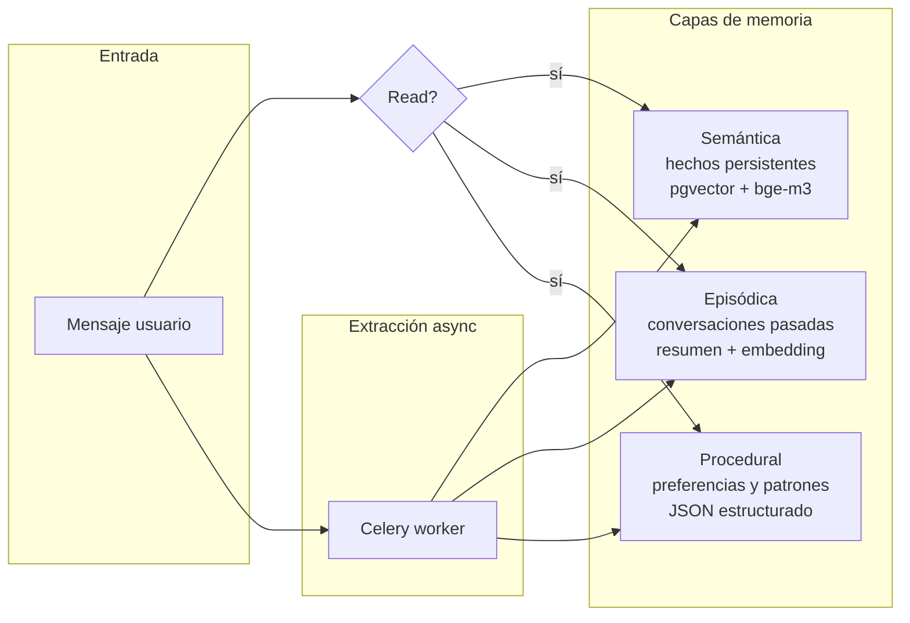

# Modelo de memoria de Ynara — 3 capas

<!-- TODO: completar con ejemplos concretos de qué entra en cada capa -->

## Capas

### Semántica
Hechos persistentes sobre el usuario y su mundo.
- "Mateo trabaja en X", "Mateo estudia Y en la UBA".
- Engine: in-house (ADR-010). Cifrado AES-256-GCM per-user; embeddings bge-m3 en pgvector.
- Store: `semantic_memory` (Postgres + pgvector).
- Embedding: bge-m3.

### Episódica
Resúmenes de conversaciones pasadas, recuperables por contexto.
- "Hace dos semanas Mateo estaba preparando un parcial de cálculo".
- Store: `episodic_memory` (Postgres + pgvector + JSONB).
- Resumen generado por Qwen al cerrar la conversación.

### Procedural
Preferencias y patrones de comportamiento.
- "Prefiere recordatorios a la noche", "saluda con 'che'".
- Store: `procedural_memory` (Postgres + JSONB).
- No requiere embeddings — lookup directo.

## Tabla operativa: `conversation_turns`

Buffer transitorio de los turnos crudos de la conversación. **No es una
capa sagrada** y es distinta de las 3 capas y del `audit_log`.

- **Operativa, no sagrada:** append-only mientras la sesión está abierta;
  el worker episódico (`consolidate_session`) la lee al cerrar la sesión
  y luego la **purga** (`purge_session`, hard-delete).
- **Cifrada igual que las capas:** el `content` viaja cifrado
  AES-256-GCM per-user (regla #4), igual que `semantic.content` /
  `episodic.summary`. Store: `conversation_turns` (Postgres + BYTEA).
- Es la fuente cruda desde la que se genera el resumen episódico; no se
  recupera en el read-path del chat.

## Módulos compartidos de `app/memory/`

- `hashing.py::compute_record_hash` — sha256 hex del contenido afectado
  para el `record_hash` del `audit_log` (la tabla sagrada de auditoría).
- `embedding.py::embed_one` — helper único de embedding (bge-m3) que
  consumen `semantic.py` y `episodic.py` (antes duplicado en cada store).

## Reglas

- **Solo Qwen escribe memoria.** Gemma solo lee.
- **Consolidación siempre async** vía Celery, fuera del path de
  respuesta.
- Las tres tablas son **sagradas** (regla #3 de `AGENTS.md`):
  migraciones requieren tests + 1 aprobación humana explícita.
